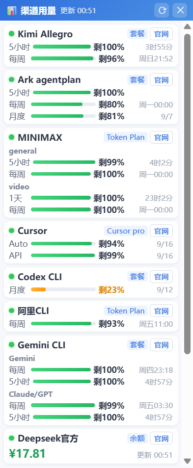

# AI 用量宠物（ai-volumetool）

> [ai-tool](https://github.com/1375692655hzh/ai-tool) 的子项目 · Windows 桌面宠物 × AI 渠道用量监控

一只住在桌面右下角的鲸鱼娘，帮你实时盯住各家 AI 编程工具的额度/套餐余量——Claude Code、Codex、Cursor、Gemini CLI、Kimi、GLM、DeepSeek、MiniMax、百炼、火山……右键即可查看全部渠道的剩余百分比与重置时间。




## 功能

- 🐳 **桌面宠物**：待机/散步/挥手/跳跃等动画，可拖拽、双击互动；形象可切换，支持自定义角色包
- 📊 **渠道用量监控**：右键 →「显示用量」，每渠道一张卡片（状态灯 + 剩余进度条 + 重置倒计时）；查询失败的渠道自动沉底、被窗口底边遮住不碍眼
- 🔌 **16 种厂商模板**：官方 API 型（填 URL+KEY 即可）与本机凭证型（读本地 CLI/桌面端登录态，零配置）双路支持，另有自动嗅探与自定义端点兜底
- 🚀 **启动工具菜单**：把常用的 AI 工具（VSCode/Cursor/各种 CLI）挂到宠物右键菜单一键拉起
- 🔒 **本地优先**：APIKEY 用系统 DPAPI（Electron safeStorage）加密落盘；本机凭证型渠道只读本地文件、只请求官方接口，无任何第三方外发

## 快速上手

### 方式一：直接用打包版

```bash
npm install
npm run dist     # 产出 dist/AI用量宠物 1.0.0.exe（便携版）与 NSIS 安装包
```

双击便携版 exe 即可运行，无需安装。数据保存在 `%APPDATA%\ai-volume-pet\config.json`。

### 方式二：源码运行

```bash
npm install
npm start        # 开发运行
npm run mock     # （可选）本地 mock 渠道服务 127.0.0.1:4789，key=sk-test，用来试添加渠道
```

要求：Windows 10/11 + Node.js ≥ 18（开发/打包），运行期无 Node 依赖。

### 第一次使用

1. 启动后宠物出现在桌面右下角，系统托盘有图标
2. 右键宠物 →「设置」→ 添加渠道（每种模板怎么填见 **[渠道配置指南](docs/channels.md)**）
3. 右键宠物 →「显示用量」查看面板：绿=正常，黄=剩余 <40%，红=查询失败，失败渠道沉底
4. 想让宠物帮你一键启动工具：设置 → 偏好 → 启动工具，每行 `名称 | app或term | 路径或命令`
5. 换形象：右键 →「🎭 形象」，或放自制角色包（格式见 **[角色形象包](docs/characters.md)**）

## 支持的渠道一览

| 模板 | 类型 | 需要什么 | 显示什么 |
|---|---|---|---|
| Kimi Coding Plan | API | URL + APIKEY | 5小时/每周窗口剩余 |
| GLM Coding Plan（个人/团队） | API | URL + APIKEY | 套餐窗口剩余 |
| DeepSeek 官方 | API | URL + APIKEY | 账户余额（可折算百分比） |
| 火山引擎 Coding/Agent Plan | API | AccessKey/SecretKey | 套餐窗口剩余 |
| OpenAI 兼容中转站 | API | URL + APIKEY | 额度已用/总额 |
| MiniMax Token Plan | 本机 | mmx CLI 登录 | 各模型组 5小时/每周剩余 |
| 阿里百炼 Coding/Token Plan | 本机 | bl CLI 登录 | 5小时/每周/月度剩余 |
| Claude Code / Pro / Max | 本机 | 订阅登录 或 用过即可 | 5小时/每周剩余（三路自适应） |
| Codex | 本机 | 用过 Codex CLI | 额度窗口剩余 |
| Antigravity / Gemini CLI | 本机 | agy CLI 登录 | 各模型组额度 |
| Cursor | 本机 | 桌面版已登录 | Auto/API 池剩余 + 重置日 |
| 自动检测 / 自定义端点 | - | URL + KEY（+字段映射） | 按接口而定 |

逐厂商的详细配置说明（去哪里拿 KEY、常见报错怎么解）：**[docs/channels.md](docs/channels.md)**

## 目录结构

```
├── main/                 # Electron 主进程
│   ├── main.js           # 入口：窗口/托盘/IPC 注册/启动工具
│   ├── windows.js        # 三个窗口（宠物/用量/设置）的创建与放置
│   ├── store.js          # 配置持久化（safeStorage 加密 APIKEY）
│   ├── characters.js     # 角色包扫描（内置 + userData/characters/）
│   ├── contextMenu.js    # 宠物右键菜单
│   └── quota/            # 额度查询核心
│       ├── sniffer.js    # 厂商模板分发 + 自动嗅探 + 各 API 型查询器
│       ├── local-clis.js # 本机凭证型查询器（Claude/Codex/Antigravity/百炼/MiniMax/Cursor）
│       ├── vscdb.js      # 纯 Node 的 SQLite 页级读取器（读 Cursor state.vscdb）
│       ├── volcano-sign.js # 火山引擎 V4 签名
│       └── poller.js     # 定时轮询
├── renderer/
│   ├── pet/              # 宠物窗口（渲染器/动画/交互）
│   ├── usage/            # 用量面板窗口
│   └── settings/         # 设置窗口
├── assets/               # 图标与默认角色素材
├── tools/mock-server.js  # 本地 mock 渠道服务
└── docs/                 # 文档（渠道配置/角色包/二次开发）
```

想给项目加新的厂商适配器、新角色渲染类型，或了解轮询/嗅探机制：**[docs/development.md](docs/development.md)**（写给人类，也写给 AI agent）。

## 隐私与安全

- APIKEY 经 Electron safeStorage（Windows DPAPI）加密后存本地 `config.json`，不明文落盘
- 本机凭证型渠道（Claude/Codex/Cursor 等）只读本地登录数据，且只把凭证发给**对应厂商自己的官方接口**
- 查询目标只有两种：你在设置里填的渠道地址、各家官方接口；没有任何统计/上报
- Cursor / Claude bootstrap / Antigravity 配额等属于**非公开接口**，厂商改版可能随时失效——报错时请提 issue

## 许可与素材

代码以 MIT 发布（见 [LICENSE](LICENSE)）。重要例外与声明见 [NOTICE](NOTICE.md)：

- 默认角色素材（鲸鱼娘 spritesheet）来自 [richray666/deepseek-whale-girl-codex-pet](https://github.com/richray666/deepseek-whale-girl-codex-pet)，**无开源许可证，仅限个人使用**，不得再分发
- 部分查询数据格式参考了社区项目 aqua5230/usage（AGPL）的公开行为，本项目为独立实现，未复制其代码
